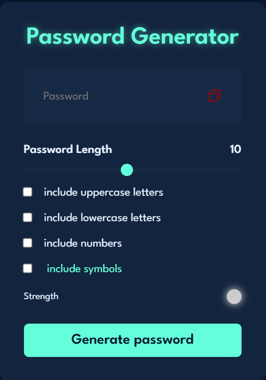

# 🔐 Secure Pass Builder

A secure password generator website that creates strong, customizable passwords. You can choose the password length, include/exclude symbols, numbers, and more.

🔗 **Live Website:** [secure-pass-builder.netlify.app](https://secure-pass-builder.netlify.app/)

---

## 📌 Features

- Generate strong random passwords
- Choose length, include/exclude symbols, numbers
- Copy password to clipboard
- Responsive and simple UI

---

## 🚀 Tech Stack

- HTML
- CSS
- JavaScript

---

## 📸 Screenshot



> (Make sure to upload a screenshot named `screenshot.png` inside the `assets/` folder)

---

## 🛠️ How to Run Locally

```bash
git clone https://github.com/shubh2724/secure-pass-builder.git
cd secure-pass-builder
